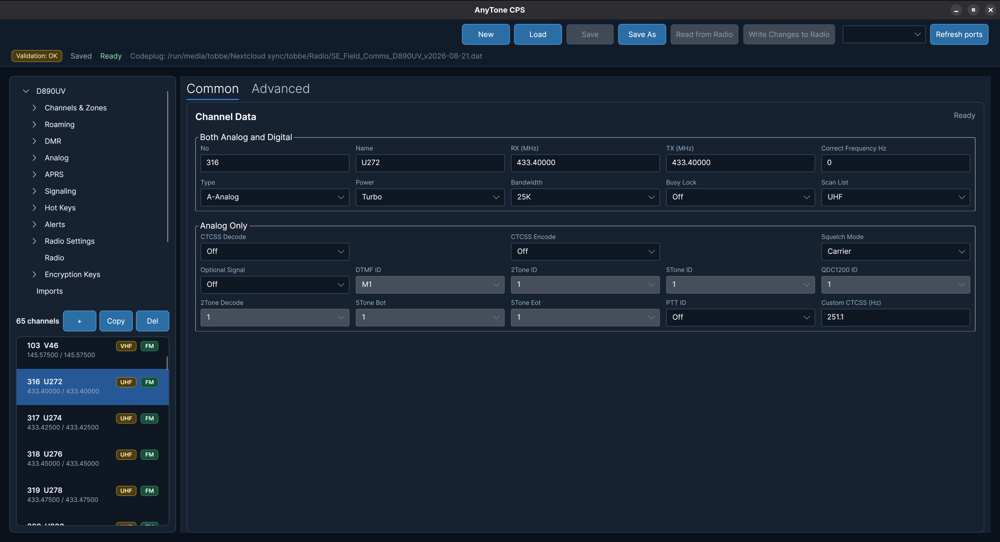
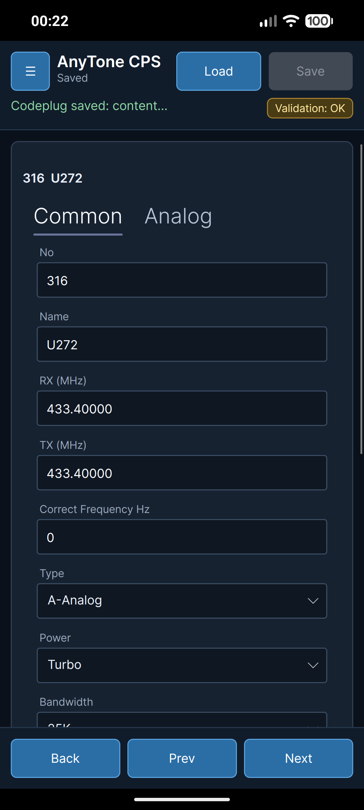
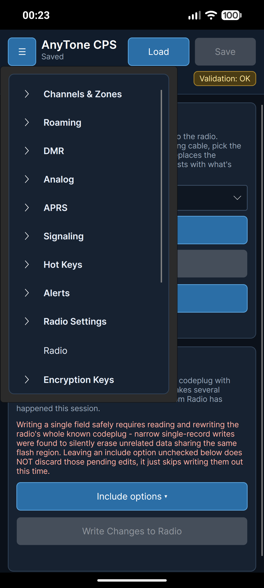

# AnyToneCPS

AnyToneCPS is an open-source, cross-platform CPS (codeplug programming
software) for the AnyTone D890UV DMR radio. It talks to the radio directly
over its USB serial protocol - reverse-engineered from scratch, byte offset
by byte offset, against real hardware - so it does not depend on or wrap
the vendor's Windows-only CPS.

## Screenshots

| Desktop | Mobile - channel editor | Mobile - radio view |
| --- | --- | --- |
|  |  |  |

## Status

Early but functional. The app already covers the large majority of the
D890UV's codeplug:

- Channels, Zones, Scan Lists, Receive Group Lists, Auto Repeater Offsets
- Roaming Channels, Roaming Zones, GPS Roaming
- Radio ID list, Talkgroups, Digital Contacts (+ whitelist), Talkgroup
  whitelist, Master ID, Prefabricated SMS
- Analog Address Book, AM Air Band, AM Zone, FM Broadcast
- APRS Settings and APRS Receive Filters
- Signaling: QDC1200, QDC Address Book, 5Tone, 2Tone, DTMF
- Hot Keys, State Information
- Talk Alias Settings, Alarm Settings
- The full Radio Settings tree (power-on, display, work mode, VOX/BT, STE,
  AM/FM, key function, GPS/ranging, VFO scan, auto repeater, record,
  volume/audio, satellite, and more)
- Encryption Keys (Digital, ARC4, AES)

Read From Radio and Write To Radio both work over USB, independently
verified against live USB captures of the vendor CPS rather than assumed
from documentation. It is not a complete drop-in replacement for the vendor
CPS yet - some fields and radio behaviors are still being confirmed one at
a time against real hardware before their write path is trusted.

Project data is saved as a JSON project file, not CSV - CSV import/export
exists in the codebase but is currently disabled while the channel data
model is being migrated to a stronger typed representation; it is not a
supported workflow right now.

## Disclaimer

This is a hobby project, built and maintained in spare time - not an
official or supported product.

- **Built and tested against the AnyTone D890UV specifically.** Other
  AnyTone models have their own codeplug layout and protocol quirks that
  are not accounted for here - do not point this app at a different model.
- **Use it at your own risk.** Writing to a radio can go wrong: during
  development, a failed write left a test D890UV showing a programming
  error and factory-reset. Back up your codeplug with the vendor CPS (or at
  least do a Read From Radio and save the project file) before writing
  anything you'd be upset to lose.
- **No support is offered.** Issues and pull requests are welcome, but
  there's no guaranteed response time and no obligation to fix, triage, or
  merge anything.
- **Not affiliated with, endorsed by, or supported by AnyTone** in any way.
  All protocol and codeplug details here come from independent reverse
  engineering against real hardware, not from AnyTone documentation.
- Provided under the MIT license (see [`LICENSE`](LICENSE)): no warranty of
  any kind, used entirely at your own risk.

## Platforms

- **Desktop** - the primary development target. Tested on Linux (Fedora),
  including a NativeAOT-published build and Fedora RPM packaging. Should
  also run via Avalonia on Windows/macOS through `dotnet run`, but that has
  not been tested.
- **Android** - fully working, including live USB read/write to the radio
  from the phone itself. Ships as a NativeAOT-published APK.
- **Browser** - builds and runs, not yet exercised against real hardware
  (no USB serial access from a browser sandbox).
- **iOS** - project scaffolding exists; no iOS toolchain has been used to
  build or test it yet.

## Technology

- .NET 10
- Avalonia UI
- CommunityToolkit.Mvvm

Five projects share one solution: `AnyToneCPS` (shared core: models,
view models, radio protocol/codecs), `AnyToneCPS.Desktop`,
`AnyToneCPS.Android`, `AnyToneCPS.Browser`, `AnyToneCPS.iOS`, and
`AnyToneCPS.Tests`.

## Getting started

Requirements:

- .NET 10 SDK

Build the solution:

```bash
dotnet build AnyToneCPS.sln
```

Run the desktop app:

```bash
dotnet run --project AnyToneCPS.Desktop
```

This is debug/JIT mode - `dotnet run` does not use NativeAOT. See below for
a NativeAOT publish.

Run the test suite:

```bash
dotnet run --project AnyToneCPS.Tests
```

(Not `dotnet test` - this project uses its own lightweight test runner in
`AnyToneCPS.Tests/Program.cs`, not the standard test-host protocol.)

## Channel labels

Each channel row shows either `FM` or `DMR`, derived directly from the
channel's `Channel Type`: `A-Analog` shows as `FM`, every other channel
type shows as `DMR`.

An optional info badge can appear to the left of `FM`/`DMR`, derived
entirely from the channel's own data: `RPTR` for a repeater channel, a
frequency band label (`VHF`/`UHF`), `JAKT` if the name contains it, `ENC`/
`ARC4` depending on which encryption is in use, `SCRA` if scrambling is on,
or `RX` for a receive-only channel.

## Android NativeAOT

The Android build uses a separate official .NET SDK install and Android NDK
27, since the Fedora-packaged .NET SDK currently has MSBuild/ILLink issues
with the NativeAOT task host.

Requirements:

- An official .NET SDK install (point `DOTNET_NATIVEAOT_ROOT` at it)
- Android SDK command line tools
- Android NDK `27.2.12479018` (point `ANDROID_NDK_ROOT` at it, if not in the
  default location the script expects)
- A phone paired over `adb`

Publish the Android APK:

```bash
scripts/publish-android-nativeaot.sh
```

The installable APK is written to:

```text
AnyToneCPS.Android/bin/Release/net10.0-android/android-arm64/publish/com.companyname.anytonecps-Signed.apk
```

Install it on the phone:

```bash
adb devices -l
adb install -r AnyToneCPS.Android/bin/Release/net10.0-android/android-arm64/publish/com.companyname.anytonecps-Signed.apk
```

The app's own Settings view shows its build mode. A NativeAOT build shows:

```text
Version ... - NativeAOT
```

## Fedora NativeAOT

Requirements for a Fedora desktop NativeAOT build:

```bash
sudo dnf install rpm-build clang lld zlib-devel
```

Publish the Fedora desktop app as `linux-x64` NativeAOT:

```bash
scripts/publish-desktop-nativeaot.sh
```

Output goes to:

```text
artifacts/desktop-nativeaot
```

Run it directly from the publish directory:

```bash
./artifacts/desktop-nativeaot/AnyToneCPS.Desktop
```

## Fedora RPM

Build an RPM from the desktop NativeAOT publish:

```bash
scripts/build-fedora-rpm.sh
```

The RPM is written to:

```text
artifacts/packages/anytone-cps-<version>-1.fc44.x86_64.rpm
```

Install it locally:

```bash
sudo dnf install ./artifacts/packages/anytone-cps-<version>-1.fc44.x86_64.rpm
```

Run it after installing:

```bash
anytone-cps
```

The RPM installs:

- `/opt/anytone-cps/AnyToneCPS.Desktop`
- `/opt/anytone-cps/libHarfBuzzSharp.so`
- `/opt/anytone-cps/libSkiaSharp.so`
- `/usr/bin/anytone-cps`
- a desktop entry and app icon under `/usr/share/`

## Project data

The app saves project data as JSON under the user's application data
directory:

```text
AnyToneCPS/SE_Field_Comms_D890UV_v1.dat
```

Settings are saved under the user's app data directory as:

```text
AnyToneCPS/settings.json
```

Paths and naming are still provisional and are likely to change as model
and export support solidify.

## Development principles

- Keep the data model simple until a given CPS field is actually confirmed
  against real hardware.
- Verify field encodings against live USB captures of the real vendor CPS
  before trusting a write path - assumptions from documentation alone are
  not enough on this radio.
- Keep general radio data separate from model- and export-specific
  details.

## License

MIT - see [`LICENSE`](LICENSE).
